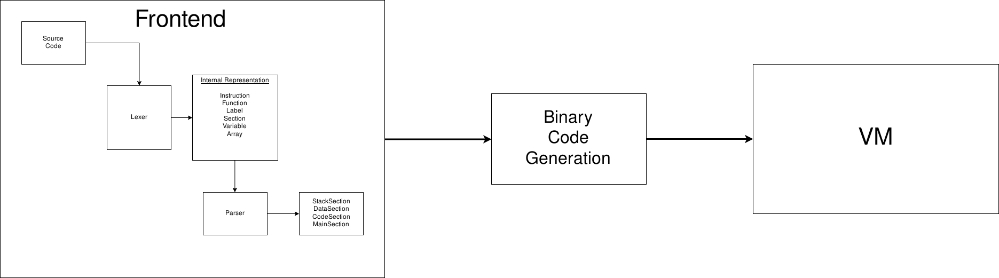
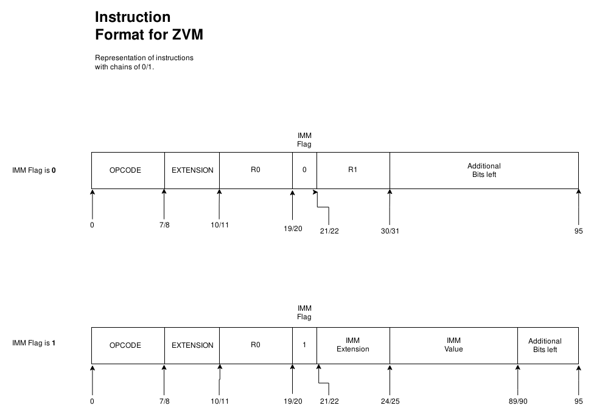

# CAUTION: Everyting what you can see in this repo is in eraly stage of development. So there are possible bugs, unhandled situations, not finished function, etc...

[Basic Architecture of the ZVM](https://www.draw.io/?lightbox=1&highlight=0000ff&edit=_blank&layers=1&nav=1&title=Untitled%20Diagram.drawio#R3VnbcuI4EP0aHqnyhVseY5IwU5tUzS5Ts7OPii1szQjJK4sA8%2FUr2ZKvAgyxAztP2O3ultR9TqslBu58vVswEEcvNIB44FjBbuA%2BDBzHsS1L%2FEjJPpPY1lRJQoYCJSsES%2FQLakUl3aAAJhVFTinmKK4KfUoI9HlFBhij26raiuLqqDEI1YhWIVj6AMOG2t8o4FEmnY1L2p8gCiM9cr7iNdDKSpBEIKDbksh9HLhzRinPnta7OcQyejoumd3Tga%2F5xBgkvI3BYrwezv%2F4x%2Ftzb8UL%2FpV8X0SzoTPL3LwBvFErVrPlex0CRjckgNKLNXC9bYQ4XMbAl1%2B3IutCFvE1Fm%2B2eFTuIONwd3Cidr58ARxI15CzvVDZFgGe6qhFpeCOtRCopIa5bbFu8aCWfkYYNNqOhQEGAhjqlTIe0ZASgB8LqVcNVKHzTGmswvMDcr5XKAcbTk3BkwMdD52YF90wHx5bkeIKYCHkxwBgTgWDGHD0Vp1H92E3RH2CxXS9AL2Jx1A%2BLrOlytxn316Z%2FqQlYvCSgcHHXBSm9ubXwr8yGCkw7quvJXbYJnbM%2BiLH3e%2FGjfdiXpl%2BoUiMnKfNnVTz5tSrVcZFZVXLST6Ny9PkNNL0DHeQXR3OjlWNiz1pCWi7t3LfYtO7KUSfrOLTXhA9cmqIrpeYjGkNRN8zBvYltVgqJEfGGZnHKVKceeyULnaTL7cNgpNlbdoSLPYBvn7Mnj9thP0LYMkN1Cl3VkWh27ZO9bbx2u36Iw78n0tx9kGUtG6IHgAH59rIJupcmxeAyAmbK6d9PLm5tDcpomMXV2I1%2BXcjD4%2FeWjAekYF7L75a8U62yjI0ViYfclmK5LdR6ZsIGB8CjEJl54twSRKWPwfQpwykuUt1ZGIYRgQWQ%2Bs0fpbWou4Jrb9gzGAi3IFa1mMjTiw1idJ69Fzqg1x0ADjD%2F2eScLZpC%2FAzHD9tSA9en8GrvG3p0mV7ep%2Fh9BtgCLziMw5gl42j2o5WVUaWDOQDfK%2B8pxzx9FgYrqQVFVornN7ZrJDksLeihKutXPQP2fsTWCMsi8cniN%2Bg9Nr91lSrUbbpTDgxtdCTvoqU7pYO7U2GMiWDNUzS6KXVKC1HhzgulS%2F38sSEFiRBCQ2Zw%2Fa4u%2Br8j1KlzUpqcJflvIpKUaLRr5SV2UarenShPfYG4wdJBtGrJgrrTW6YCZSInRqR8Gva%2FA5HHR0gxzX0G8B%2FZwC%2F2xf23dE1Tgpib6I%2F80tot9uzg74HPn1feHfNw4Njuos6i7Wu0wVrzV48REAajHfT92aWVL44%2FYi5G7b7tOD0tLwFJJBV%2BtSuKu5HH2Puanc19nTcqJKOqUra097K5Oz%2FVSY7vz%2Bz861KX2zV27EDF2hNT6NTnnq%2BXHYPF973dTrfXg7y7MqMasQ8vwUoUWpk6rovuRoQr8VfwVnWin%2FU3cf%2FAA%3D%3D)

# ToDo List:
* Instruction set isn't implemented yet.
* Improve debugging messages
  * Add support for turning ON/OFF colors
  * Add support for file-based logs

* Name checking
  * Add support for name redifinition check
  * Control access to undefined names

* PLI/VPI or DPI support
  * Consider to implement CPU on Verilog and connect it our virtual machine via
VPI/PLI or on SystemVerilog and make connection via DPI
